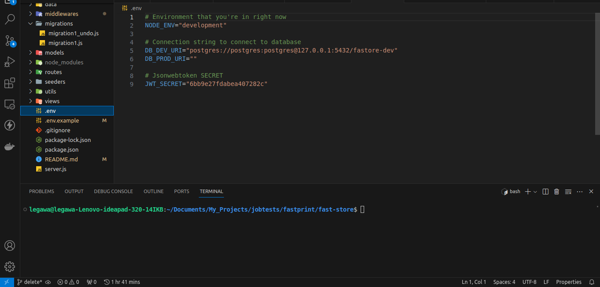

# fast-store
A server-side application that uses template engines and MVC architecture to perform basic CRUD operation.

## List of Available Commands

```js
npm install // to install all required dependencies to run this project

npm run dev // to run this project on development environment

npm run randomString // to generate a random string of characters

npm run doMigrate // to do migration(Create tables)
npm run undoMigrate // to undo migration(Drop tables)

npm run doSeeding // to seed data into tables
npm run undoSeeding // to undo seed data from tables
```

# How to run on your local machine
### Requirements
- Node.JS instaled https://nodejs.org/en/download
### 1. Setup environment variable
- Create your own database locally, this project is using postgresql for its database

- Make a file with name .env and see required environment variable in .env.example file(See .env.example files, there should be an explanation and example for each variable) and type the environment variable in the .env file you just created.



### 2. Setup local database
- This step assumed you have installed postgresql and created your own database if you haven't check out this tutorial https://www.postgresqltutorial.com/postgresql-getting-started/

- Make sure to have environment variables set properly

- Run 'npm i' on your terminal, make sure your terminal is in the same folder with 'package.json' file(inside the folder you just cloned)

- Run 'npm run doMigrate' to migrate table into your database, you can undo it by using command 'npm run undoMigrate' to drop all table

- Run 'npm run doSeeding' to insert all data into all tables, to undo it type command 'npm run undoSeeding'

### 3. Run locally

- Run 'npm run dev' in terminal
- Visit localhost:3000/ in browser and done! You just run this project on your local machine

# Project Details

## Schema


## Features
- User login and logout
- User can register a new user on their behalf after login
- User can see list of products
- User can see the detail of the products
- User can create product
- User can delete and edit only their created product

